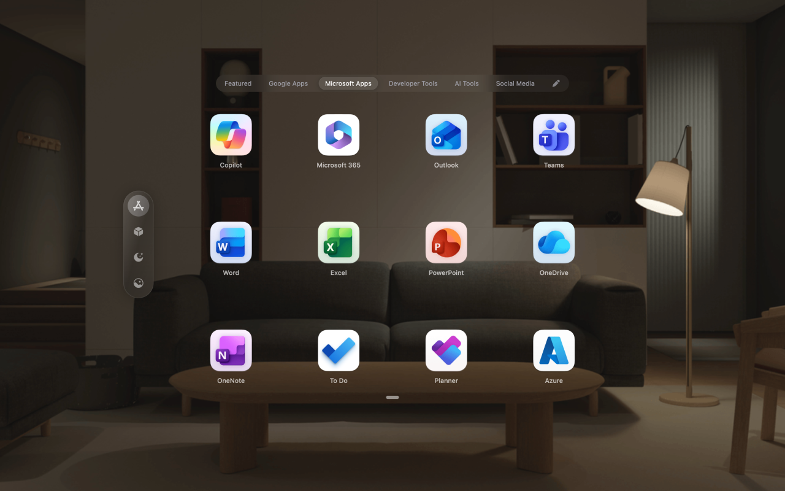

# Vision Dashboard – Mindful Productivity Hub

Supercharge your focus with a new tab designed to eliminate distractions and amplify your productivity potential.

This is a [Plasmo extension](https://docs.plasmo.com/) project bootstrapped with [`plasmo init`](https://www.npmjs.com/package/plasmo).

---

## ✨ Features

- 🧘 **Mindful Productivity Hub** – Start every session distraction-free.
- 🌄 **Customizable Dashboard** – Tailored wallpapers, widgets, and shortcuts.
- ⚡ **Fast & Local-First** – Powered by Chrome LocalStorage, no server data collection.
- 🎨 **Modern UI** – Built with React, TailwindCSS, and HeroUI.
- 🛠️ **Extensible** – Designed for customization and contributions.

---

## Vision Dashboard – Screenshots & Banners

| Focus Mode View                                       | Environments                                                 |
| ----------------------------------------------------- | ------------------------------------------------------------ |
|  |  |

| Alternative Layout 1                                             | Alternative Layout 2                                             |
| ---------------------------------------------------------------- | ---------------------------------------------------------------- |
|  |  |

---

## 🚀 Getting Started

Install dependencies:

```bash
pnpm install
# or
npm install
```

Run the development server:

```bash
pnpm dev
# or
npm run dev
```

Open your browser and load the appropriate development build. For example, for Chrome (MV3):

```
build/chrome-mv3-dev
```

---

## 📦 Making a Production Build

```bash
pnpm build
# or
npm run build
```

This generates a production-ready bundle for publishing.

---

## 🌍 Browser Targets

You can build specifically for:

```bash
npm run build:chrome       # Chrome (MV3)
npm run build:firefox:v2   # Firefox (MV2)
npm run build:firefox:v3   # Firefox (MV3)
npm run build:edge         # Microsoft Edge
npm run build:brave        # Brave
npm run build:opera        # Opera
npm run build:safari       # Safari
```

---

## 🛠️ Tech Stack

- [Plasmo](https://plasmo.com) – Extension framework
- [Next.js](https://nextjs.org/) – App framework
- [React 19](https://react.dev/) – UI library
- [Tailwind CSS](https://tailwindcss.com/) – Styling
- [HeroUI](https://heroui.com/) – UI components
- [Zustand](https://zustand-demo.pmnd.rs/) – State management
- [TypeScript](https://www.typescriptlang.org/) – Type safety
- Plus: SWR, Axios, Immer, Lodash, Day.js, Rough Notation

---

## 🤝 Contributing

We welcome contributions!

1. [Fork the repository](https://github.com/simpleneeraj/vision-dashboard/fork)
2. Clone your fork:

   ```bash
   git clone https://github.com/<your-username>/vision-dashboard.git
   cd vision-dashboard
   ```

3. Create a new branch:

   ```bash
   git checkout -b feature/my-feature
   ```

4. Commit your changes:

   ```bash
   git commit -m "Add my feature"
   ```

5. Push and create a Pull Request 🎉

See [CONTRIBUTING.md](./CONTRIBUTING.md) for more details.

---

## 📜 Credits

This project is built with love for developers & creators.

### Open Source Libraries

- React, Next.js, Tailwind CSS, HeroUI, SWR, Zustand, Axios, Immer, Lodash, Rough Notation, Day.js

### Figma Community Resources

- [Apple Design Resources for visionOS](https://www.figma.com/community/file/1253443272911187215/apple-design-resources-visionos)
- [Vision Pro Prototype](https://www.figma.com/design/lLdER55nkPXJLFyVYYxgpo/Introducing-Vision-Pro---Prototype-with-Figma--Community-?node-id=1-63&t=Q28QA4hk2AcDGumJ-0)
- Plus additional Figma Community files (see [Credits Page](./docs/CREDITS.md))

---

## 📄 License

This project is licensed under the **MIT License** – see the [LICENSE](./LICENSE) file for details.
